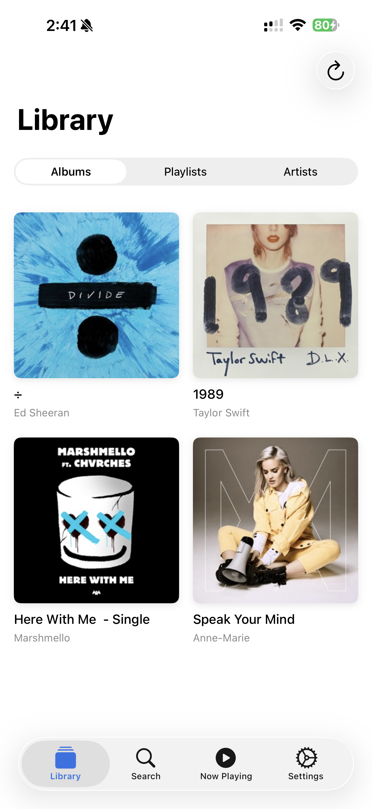
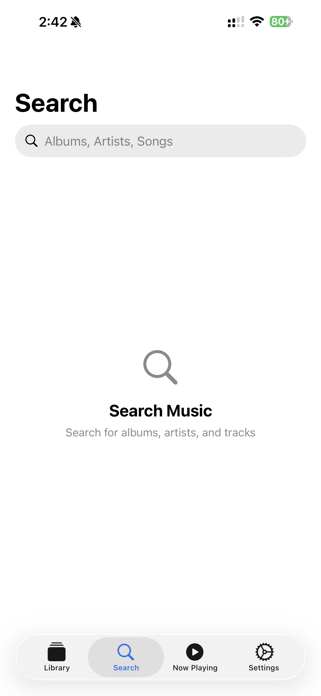
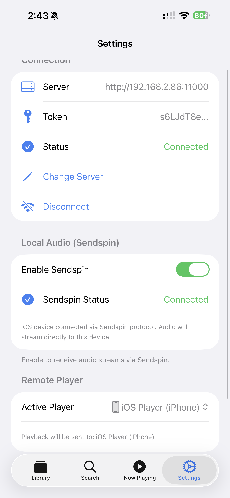

#  Hi, I'm Xonora.

**A native iOS client for Music Assistant.**

I built Xonora because I wanted a fast, native, and beautiful way to stream music from my [Music Assistant](https://music-assistant.io/) server to my iPhone. No web views, no clunky interfaces—just pure, native Swift.

It connects directly to your server and streams audio using the **Sendspin** protocol, meaning you get high-quality audio with almost zero latency.

### 📸 A Look Inside

  
  
  

  
  
  

---

### ✅ What's Working Right Now?
I've been working hard on the core plumbing, and the alpha is solid for daily listening:

*   **Sendspin Streaming:** It actually works! It connects to your server (even on secure ports like 11000) and streams PCM audio seamlessly.
*   **Authentication:** Full token-based auth support.
*   **Library Browsing:** Albums, Artists, Playlists—it's all there and loads fast thanks to local caching.
*   **CarPlay:** Yes, you can browse and play your library safely while driving.
*   **Now Playing:** A dedicated, clean player interface.
*   **Search:** Find what you need instantly.
*   **Smart Connection:** It handles dynamic ports and bypasses tricky network proxies (like iCloud Private Relay) to keep your local connection stable.

**⚠️ Known Issues (Alpha Warning):**
*   **Audio Stuttering:** You might experience stuttering or dropouts, especially when the app is in the background or under heavy network load.
*   **Stability:** Things *will* break. This is an alpha release.
*   **Bugs:** Background playback handling is still being tuned.

### 🚧 What's Coming Next?
*   **Queue Management:** Drag-and-drop to reorder your tracks (Coming very soon!).
*   **Player Groups:** A UI to easily group speakers for multi-room audio.
*   **Radio:** Browsing and starting radio stations.

### 📲 Try the Alpha
I've included an alpha build (`Xonora-alpha.ipa`) in this repository.
If you know how to sideload apps (using AltStore, Sideloadly, or Xcode), give it a spin!

### 🤖 Credits
This project was brought to life with the assistance of **Gemini** and **Claude** AI.

### 💭 I Want Your Feedback
This is a passion project, and I'd love to hear what you think.
*   Does it feel fast enough?
*   Is the design what you expected?
*   Did you break it? (Please tell me how!)

Open an issue, start a discussion, or just let me know. Enjoy the music! 🎵